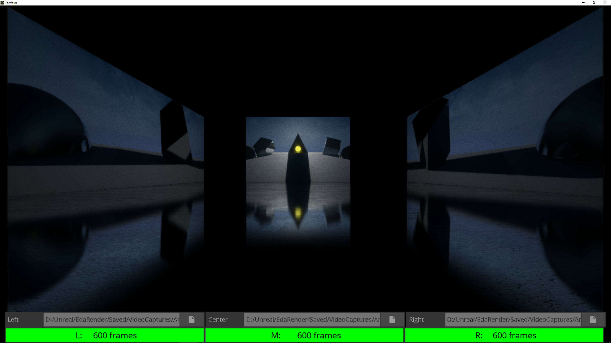

# EDA Previsualization

This TouchDesigner project provides a real-time previsualization system for UCLA's EDA Immersive Projection System.

[Download this project here.](https://github.com/L05/EdaPrevis/archive/master.zip)

Alternatively, click on *Clone or download* and then select *Download ZIP*. You can also close this Github repository if you are a Github user.

In order to run this project, you'll need to [download TouchDesigner](https://www.derivative.ca/099/Downloads/experimental.asp) and have at least a non-commercial license, which you can get by registering for a free account. This project was created in Version 2019.13330.

To load files, move your mouse towards the bottom of the window and use the Load File buttons. All files should have the same number of frames, and the program will indicate this towards the bottom of the window. Note that, the middle video channel is what drives playback for all three, ensuring that they are frame-synchronized with one another.

## File Specifications

The EDA Immersive Projection System expects three video files:
* Left: 3840x1200
* Center: 1920x1200
* Right: 3840x1200

Please see the DESMA 24 [Submission Guidelines](http://classes.dma.ucla.edu/Spring19/24/index.php/submission-guidelines/) for further information on specs and recommended encoding procedures.
